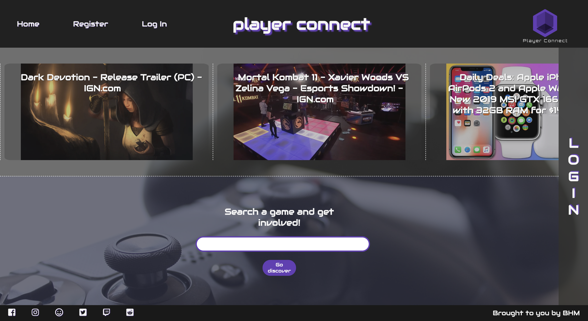
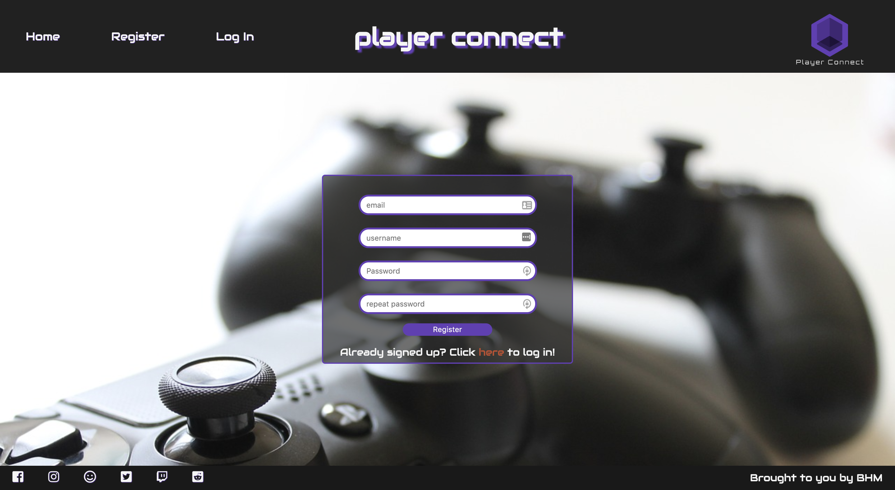
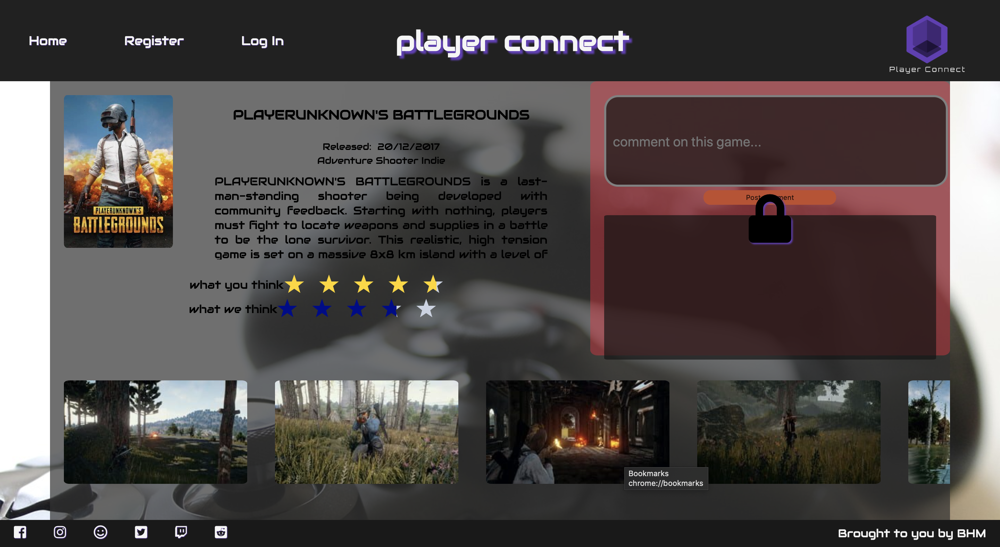
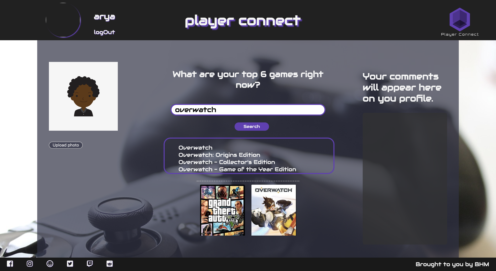
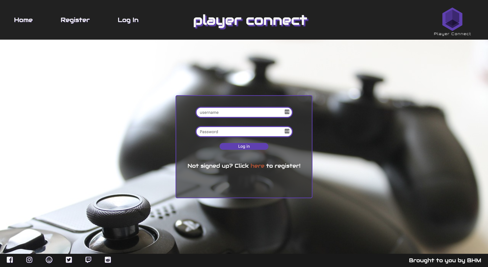
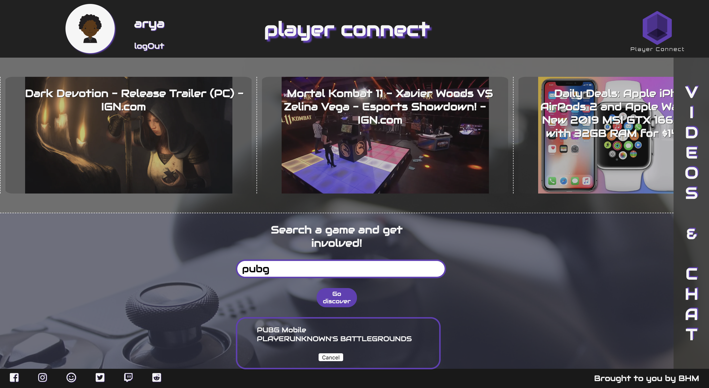
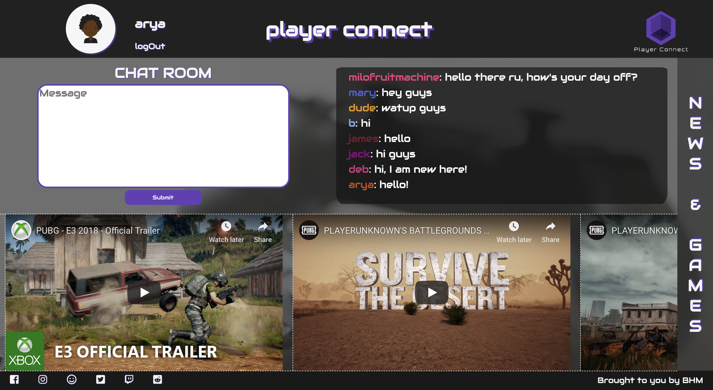
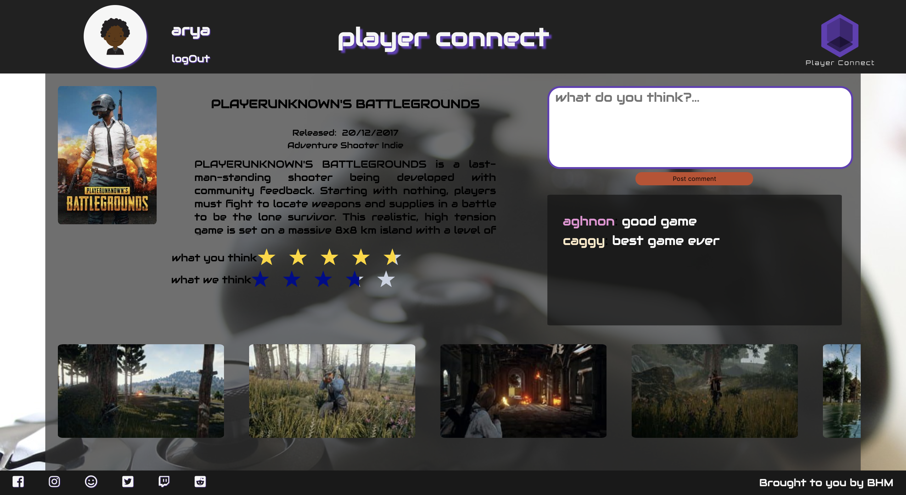
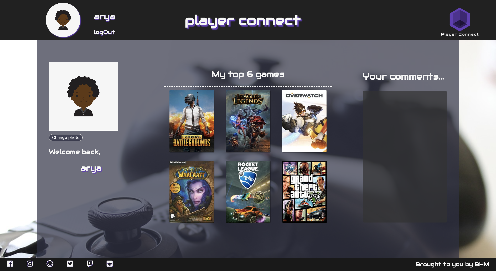
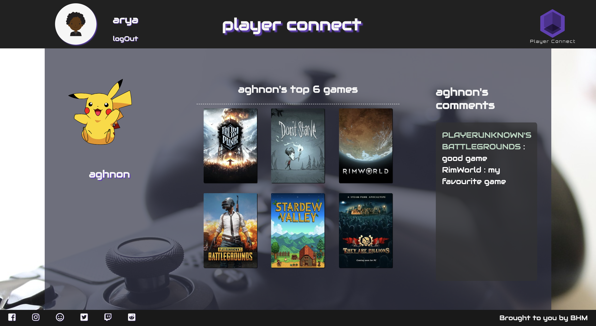

# Player Connect
## WDI Project 3 

### Goal
To build a full-stack application by making backend(Node.js) and front-end(React) and by using an Express API to serve the data from a Mongo database.

### Project Overview
I developed this project with two other students, we created a gaming app. This gaming app allows users to create their own profiles by choosing their favourite video games. Their profile also gives them access to gaming news, chat functionality and view other profiles.

### Website
https://player-connect.herokuapp.com/

## Timeframe
9 days

## Technologies used
* HTML5
* CSS - SASS
* JavaScript (ES6)
* React
* Node.js
* Express
* MongoDB
* APIs: IGN(news) and IGDB(games)
* Insomnia
* FileStack
* Mocha (test)

## Process
### Home page & Search games
Home page allows everyone access to the news and search for the games.


### Register
Users need to register and log-in if they would like to create a profile, view other users' profile, participate in chat and comment on games.


Unregistered users can access to the games page, however they can not make any comments about the games.


### Create profile
Following registration, the app takes the users to the create their profile page, where they can upload a profile photo and search for their favourite games. They can share  six of their favourite games on their profile. They can complete creating their profile, once they upload a photo and choose six games.


### Login
Login page


### Home page - logged in & Search games
Once logged in homepage looks like this, allows users to access to the chat room and the videos.


### Chat
This is the chat room where online users can chat in real time.


### Comment on games
Once the users are logged in they can make comments about the games.


### View own profile
This is how you view your own profile page.


### View others' profile
This is how you view others' profile page.


## Challenges
* IGDB API was not straight forward. It was not accepting JSON. We needed to figure out how to retrieve the data from the IGDB API.
* Creating a search function was challenging due to IGDB API being not straight forward.

## Wins
* Learnt how to create a chat function and creating user profiles.
* Search function was useful and we used it on the "create profile" page as well.
* The code for the search function is as below:
```javascript
import React from 'react'
import axios from 'axios'
import Popup from '../components/popup'
import {withRouter} from 'react-router-dom'

class GameSearch extends React.Component {
  constructor(){
    super()

    this.state = {
      isOpen: false,
      data: {},
      errors: {},
      results: []
    }

    this.handleChange = this.handleChange.bind(this)
    this.handleClick = this.handleClick.bind(this)
    this.closePopup = this.closePopup.bind(this)
  }

  handleChange({ target: { value } }) {
    this.setState({...this.state, query: value })
  }

  handleClick(e) {
    e.preventDefault()
    axios.post('/api/games', {game: this.state.query})
      .then(games => {
        console.log(games.data)
        this.setState({results: games.data})
        this.openPopup()
      })
      .catch(err => console.log(err))
  }

  openPopup (){
    this.setState({
      isOpen: true
    })
  }

  closePopup () {
    this.setState({
      isOpen: false
    })
  }

  render() {
    return(
      <div className="main-gameSearch animated fadeIn">
        <div className="contains-gameSearch animated fadeIn">
          <h2> Search a game and get involved! </h2>
          <input
            className="gameSearchBar"
            onChange={this.handleChange}
          />
          <button className="gameSearchButton"
            onClick={this.handleClick}> Go discover
          </button>
          <Popup
            show={this.state.isOpen}
            games={this.state.results}
            onClose={this.closePopup}>
          </Popup>
        </div>
      </div>
    )
  }
}

export default withRouter(GameSearch)
```

## Future Features
* Responsive web design
* Friend requests
* Private chat between users
* Show recommended videos for each user
